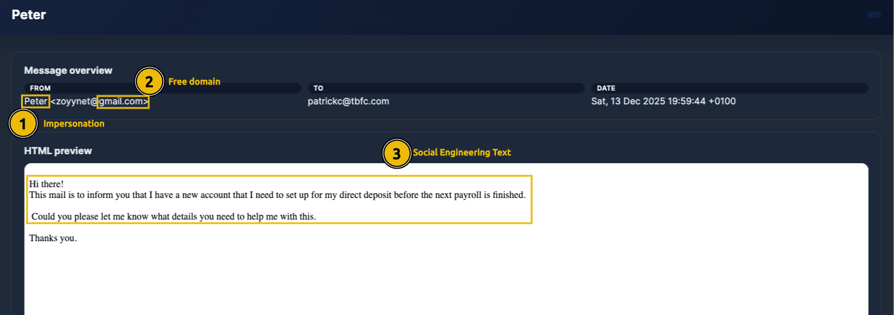
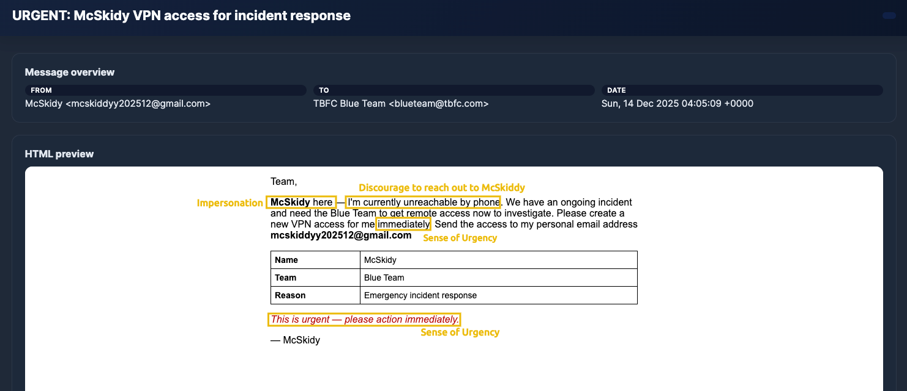
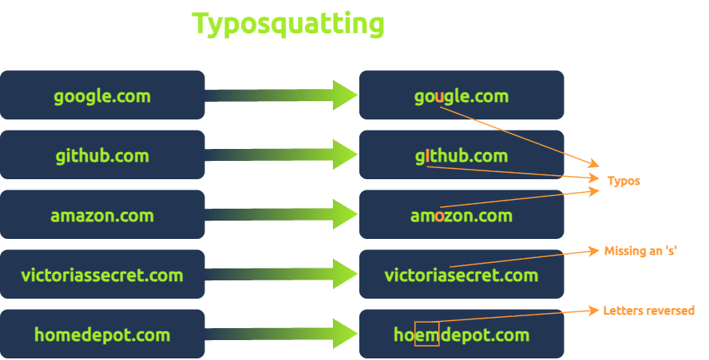
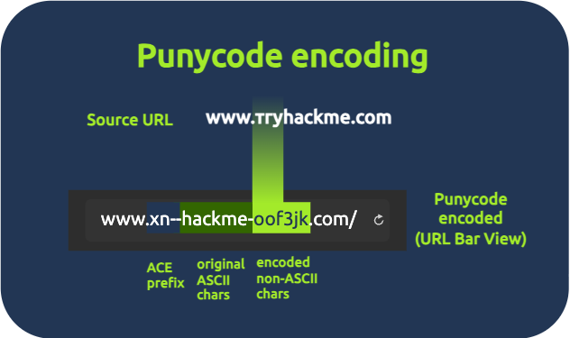
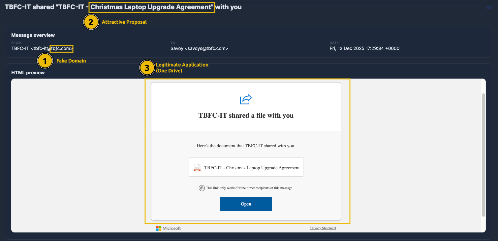
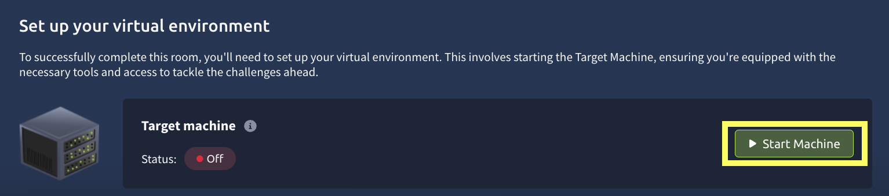
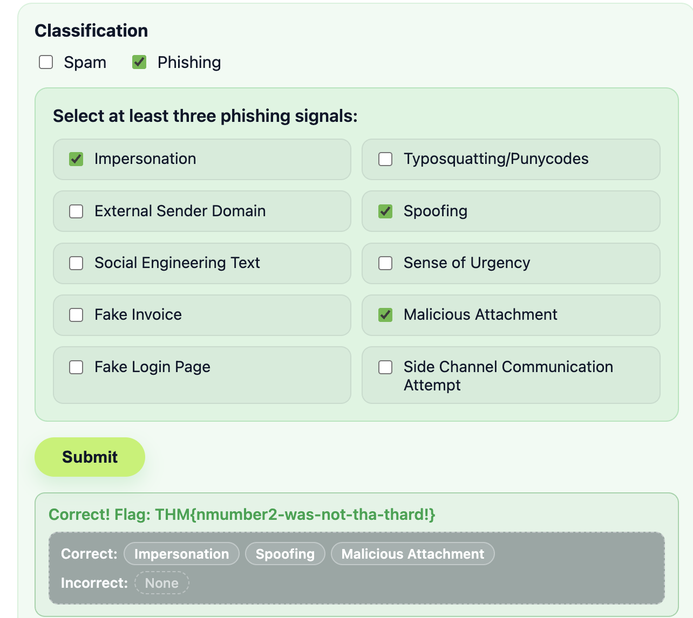
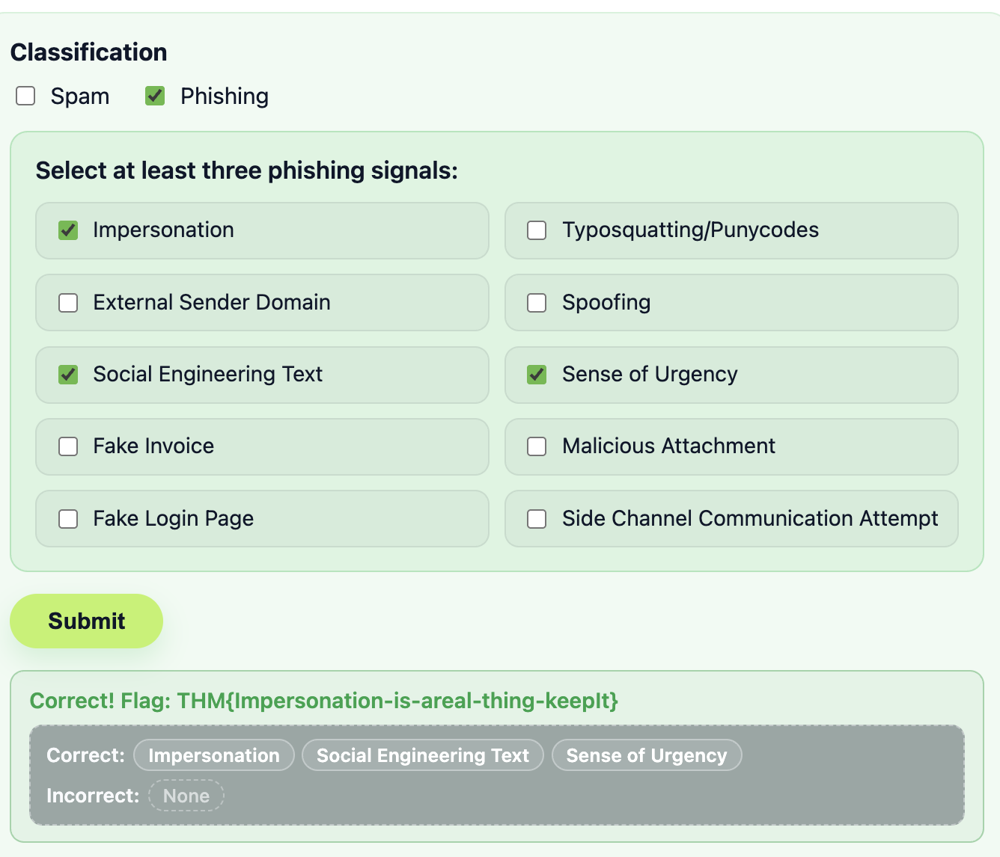
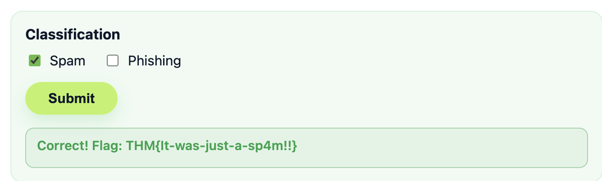
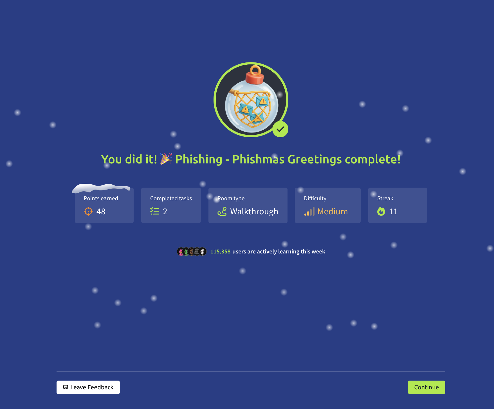

# Advent of Cyber 2025 Day 12 Walkthrough Phishing - Phishmas Greetings

First of all we will go through the important  concept  and then we will solve the lab.

Story Plot : 
TBFC's defence is weak and email protection platform is down. The staff must triage every suspicious manually because all filter are offline. The SOC suspect phishing message was send by Malhare Eggploit Bunnies to TBFC's users in order to steal credentials and also disrupt SOX-mas.

 we joined the incident response task force to identify legit and phishing emails.

- Learning Objectives
- Spotting Phishing emails
- Learn trending phishing techniques
- understand the difference between spam and phishing

### Introduction

Phishing is one of the most effective and oldest cyber trick for stealing secret information or credentials.

Phishing has evolved focusing on precision and  making someone believe. With carefully crafted message that mimic real people, portal or internal process to trick even the cautious users.

some common intentions behind phishing are :
- credential theft
- malware delivery
- Data exfiltration
- Financial fraud

Example:  attacker impersonate an employee to modify employee payroll and perform financial fraud using free domain.

phishing remain the easiest path for initial access that target one vulnerability (people) technology can't fix.

#### Why spam is not phishing ?

span is just a digital noise mostly harmless they focus on quantity over precision. IT focus on sending bulk spam message to flood inboxes with unwanted marketing or irrelevant content. The goal is to push exposure or engagement rather than stealing data.

some common intentions behinf spam messages :
- Promotion
- scams
- Traffic generation
- data harvesting

example:
This email intention is for marketing not to steal data.

#### The Phishmas Takeover

some of the common phishing techniques, attacker use to attempt phishing

### Impersonation
attacker act as a person, department or a service to laure users.

our example shows subject "URGENT: McSkidy VPN access for incident response" and checking From of message show impersonating  user by using free domain from gmail which does not align with TBFC;s domain.

### Social Engineering
It is the art of manipulating people rather than breaking technology. attacker craft believable stories, emails, call or chat message that exploit emotions (fear, helpful, curiosity, urgency) and real world context to laure the victim.

### Typosquatting and Punycode

In case of typosquatting, attacker register common misspelling organisational domain changing some letters and target users lack of attention.

punycode is a special encoding system that converts Unicode characters into ASCII. Typing punycode in the browser URL bar this will be translated into ASCII format which is accepted format by DNS.
attacker can replace identical latin letters.

when we check sender email we can identify latin letter  `ƒ` instead of  `f` which justify punycode usage for an email domain.

an easy way for identifying punycode is to look field ==Return-Path== in email header, we will see ACE prefix and encoded non-ASCII characters! 

### Spoofing
Email spoofing is a way attacker trick users into thinking they receive emails from a legitimate domain.

The message look like received from legitimate sender but underlying header tell different story.

It look like real domain from TBFC but check essential field in email header`Authentication-Results` and `Return-Path`

Authentication-Results help to confirm if email really confirm from who it says it does.
- **SPF:** Says which servers are allowed to send emails for a domain (like a list of approved senders).
- **DKIM:** Adds a digital signature to prove the message wasn’t changed and really came from that domain.
- **DMARC:** Uses SPF and DKIM to decide what to do if something looks fake (for example, send it to spam or block it).
when both SPF and DMARC fails , its strong sign the email is spoofed.
on Return-Path we can see real email address.

### Malicious Attachements

 malicious attachment have multiple goal. when opened the file it can install malware, steal password or give attacker access to device or network.
HTA/HTML files are commonly used for phishing because they run without browser sandboxing, meaning script have full access to the endpoint upon execution.

### Trending Phishing

It focus tricking user to leave company secure environment which often use legitimate tools or webiste to laure  look trustworthy  and get user credentials or download malicious file themselves.

### Legitimate Applications
attacker hiding behind trusted services such as Dropbox,Google docs and One Drive because the link look legitimate and often pass email filters.

once user click the link, it redirect to a shared document with fake content. The goal is to steal credentials or download malicious files.

### Fake Login pages

the main goal is to steal credential by tricking  user to enter credentials into login pages.

checking url we can see fake domain microsoftonline.login444123.com/signin

### side channel communications

side channel communication happen when an attacker moves the conversation off email to another channel such as SMS, Whatsapp, a phone , a texted link or share document to continue social engineering in a platform without company control.

####  Time To Spot the Phish and Save SOC-mas!

Mission : triage the email, seperate spam from phishing and identify three clear signals for every phishing email. 

selecting right phishing email  will help to catch a flag and to complete the room we need to collect all phishing emails.

## Lab
Now we will walk through lab to catch flags.start machine to get target machine ip. 
##### connecting to the machine

visit https://10-82-138-202.reverse-proxy.cell-prod-eu-west-1c.vm.tryhackme.com/ accessing the  portal we see mail portal. 

first we check  sender  1st email it looks legitimate, then after reading message when we check attachment there is no invoice so it fall on Fake invoice category, secondly in message we see sense of urgency " Call PayPal immediately"  and at last when we check header  specially Authentication-Results  , both "spf" and "dkim" fails  so its definitely a spoofing email.  when submitting the result , classifying it as phishing email  we catch our fist flag.

==Flag: THM{yougotnumber1-keep-it-going}==

For the second email, we first check sender email  <calls@tbfc.com> , attacker impersonate as  miscall notifier so its phishing email not spam.when we check main message , it says  "a new voice message " then checking attachment we see file.html  it falls in malicious attachment and finally we check header Authentication-Results section both spf and dkim fails and checking Authentication-Results-Original section we see actual email address "gw3097.weakmail.com" attacer spoof the email form tbfc domain. so we choose spoofing signal. after submitting we catch our second flag.

==Flag : THM{nmumber2-was-not-tha-thard!}==

For third message, when we check sender email and body we found suspicious that signal is is phishing email. 

"This is urgent- please action immediately" is signal to 
sense of urgency,  reading the message content "unreachable by phone ... send access to email" indicate social engineer text and  "my personal email ...." impersonating act as an employee but using personal email. 

==Flag : THM{Impersonation-is-areal-thing-keepIt}==

checking 4th email 
firs we saw no-reply@dropbox.com> as sender email, so the email impersonate as TBFC HR department so we select phishing email and out first choice is impersonating and the domain is from dropbox, ist means external sender domain. 

, secondly there a message  "Annual Salary Raise Approval.pdf" and  button to open file or message said we can paster url if we don't have dropbox account.. we know that   its social engineering text to laure victim.
 

==Flag: THM{Get-back-SOC-mas!!}==

checking message 5 , we saw no any attachment or  link, just an advertise campaign for  "**CandyCane Co. Logistics Platform**". so its most probably spam email.
 
 
==Flag: THM{It-was-just-a-sp4m!!}==

check message 6,  first when we see sender email and name  there we see ƒ and with original domain f. so its an phishing email and fall in Typosquatting/Punycodes. secondly  the information attachment says TBFC-IT share a document  which is laptop upgrade agreement, its social engineering text to laure victim to open the file at last the attacker is impersonating as TBFC IT. 

==Flag: THM{number6-is-the-last-one!-DX!}==

### Questions 

1. Classify the 1st email, what's the flag?
==Flag: THM{yougotnumber1-keep-it-going}==

2. Classify the 2nd email. What's the flag?
==Flag : THM{nmumber2-was-not-tha-thard!}==

3. Classify the 3rd email. What's the flag?
==Flag : THM{Impersonation-is-areal-thing-keepIt}==

4. Classify the 4th email. What's the flag?
==Flag: THM{Get-back-SOC-mas!!}==

6. Classify the 5th email. What's the flag?
==Flag: THM{It-was-just-a-sp4m!!}==

6. Classify the 6th email. What's the flag?
==THM{number6-is-the-last-one!-DX!}==

7. does not require any answer just  click check.

You have successfully completed Advent of Cyber 2025 Day 12 Walkthrough Phishing - Phishmas Greetings. 
