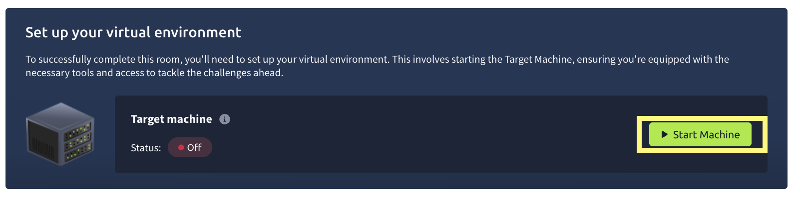
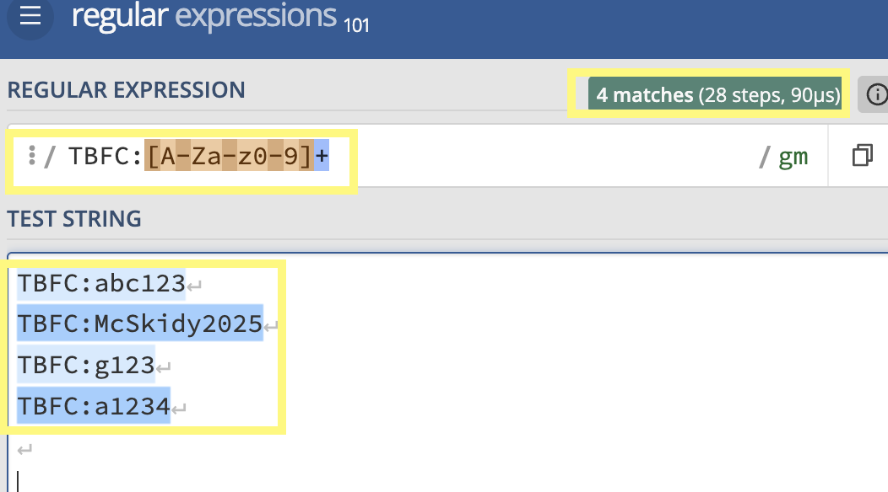
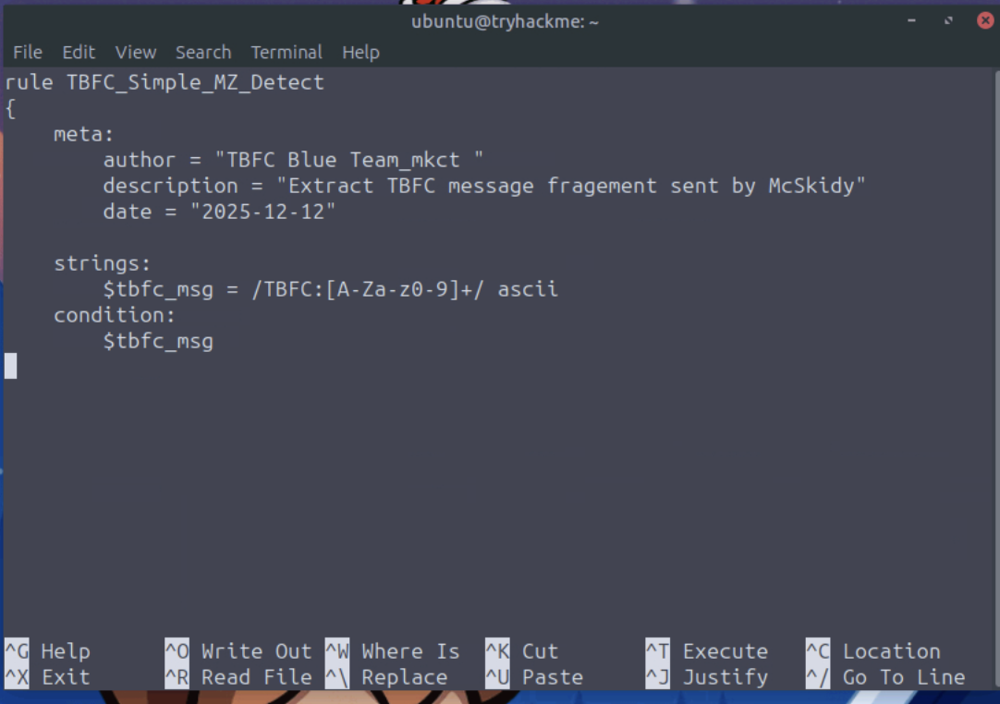
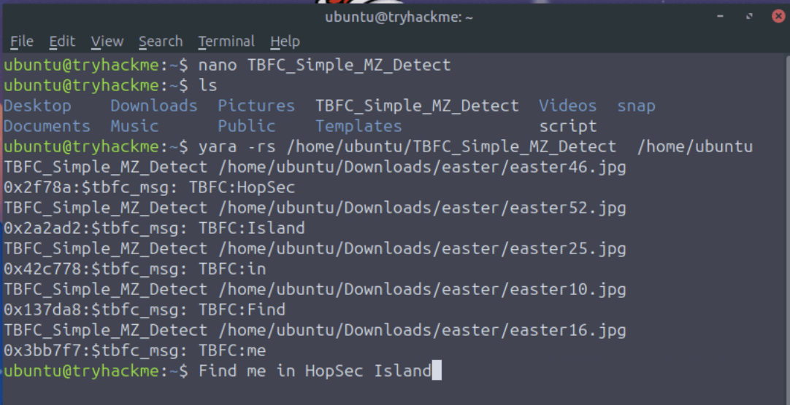

# Advent of Cyber 2025 Day 13 Walkthrough YARA Rules - YARA mean one


First of all we will go through the important  concept  and then we will solve the lab.

Story plot:
Even though the disappearance of McSkidy, TBFC faced chaos but MCskidy was trying to help TBFC blue team. McSkidy send a bunch of images to the blue team from an anonymous location that were related to easter preparation,  they contain a message send by MCSkidy. The crisis communication outline that the message might be sent through a folder of images containing hidden messages which can be decoded if keyword is known. The blue team has to create YARA rule that runs on the directory containing the images. The YARA must trigger on a keyword followed by a code word which help to extract the code word in ascending order the will be able to decode the message.


## Learning Objectives

- Understand the basic concept of YARA.
- Learn when and why we need to use YARA rules.
- Explore different types of YARA rules.
- Learn how to write YARA rules.
- Practically detect malicious indicators using YARA.

#### YARA Overview

YARA is a tool to identify and classify malware by searching for unique pattern, the digital fingerprints left behind by attackers. Yara scan code, files and memory for subtle traces that reveal a threats identity.


#### Why YARA MATTERS AND WHEN TO USE It
YARA give defender the detection malware power by its behaviour and pattern. It allows us to define own rules and provide our own view of what constitute malicious behavior. 

##### when to use this tool :
- Post-incident analysis: when the security team needs to verify whether traces of malware found on one compromised host still exist elsewhere in the environment.

- Threat Hunting: searching through systems and endpoints for signs of known or related malware families.

- Intelligence-based scans: applying shared YARA rules from other defenders or kingdoms to detect new indicators of compromise.

- Memory analysis: examining active processes in a memory dump for malicious code fragments.

##### YARA Values
with YARA we have a power to create own rules, detect new variants and act before the threat spreads.  In general YARA provide power for defender for active hunting by turning intelligence into action before the attacker strike again.

It provide many benefits :

- **Speed**: quickly scans large sets of files or systems to identify suspicious ones.
- **Flexibility**: detects everything from text strings to binary patterns and complex logic.
- **Control**: lets analysts define exactly what they consider malicious.
- **Shareability**: rules can be reused and improved by other defenders across kingdoms.
- **Visibility**: helps connect scattered clues into a clear picture of the attack.

#### YARA Rules
 It have several key elements:
 
- Metadata: information about the rule itself: who created it, when, and for what purpose.
- Strings: the clues YARA searches for: text, byte sequences, or regular expressions that mark suspicious content.
- Conditions: the logic that decides when the rule triggers, combining multiple strings or parameters into a single decision.

Example: 
```php
rule TBFC_KingMalhare_Trace
{
    meta:
        author = "Defender of SOC-mas"
        description = "Detects traces of King Malhare’s malware"
        date = "2025-10-10"
    strings:
        $s1 = "rundll32.exe" fullword ascii
        $s2 = "msvcrt.dll" fullword wide
        $url1 = /http:\/\/.*malhare.*/ nocase
    condition:
        any of them
}
```


##### String
Strings are the clue YARA searches for scanning files, memory or other data sources. they represent  the signature of malicious activity in fragments of text, bytes or pattern. 

 There are 3 types of string which have separate purpose.
##### Text strings
IT represent words or short text which appear ina file,script or memory. default Yara treat text strings as ASCII and case sensitive  but we can modify how they behave using special modifiers, by aded small keywords after the string definition.

Example to search "Christmas" inside a file: 
```php
rule TBFC_KingMalhare_Trace
{
    strings:
        $TBFC_string = "Christmas"

    condition:
        $TBFC_string 
}
```

###### Case-insensitive strings - nocase
adding the ==nocase== modifier ignore the letter casing, it will trigger all results.
 Example :
 ```php
strings:
    $xmas = "Christmas" nocase
```

##### Wide-character strings - wide, ascii
adding wide tells YARA look for format while ascii enforce a single byte search.we can use both together

```php
strings:
    $xmas = "Christmas" wide ascii
```

##### XOR strings - xor
using xor modifier will check all possible single byte XOR variations of a string  revealing what attacker tried to control.

```php
strings:
    $hidden = "Malhare" xor
```

##### Base64 strings - base64, base64wide
 we can decode the content and search for original patter even though its hidden in encoded form.
 
 ```php
strings:
    $b64 = "SOC-mas" base64
```

##### Hexadecimal strings

by using hex string  it allow search for specific byte patterns that is written in hexadecimal notation.it is really useful when detect malware fragments like file header, shell code or binary signature and cant represented as plain text.

```php
rule TBFC_Malhare_HexDetect
{
    strings:
        $mz = { 4D 5A 90 00 }   // MZ header of a Windows executable
        $hex_string = { E3 41 ?? C8 G? VB }

    condition:
        $mz and $hex_string
}
```

##### Regular expression strings


malware sometime mutate the code, make changes in file name, urls or commands making harder to detect using plain text or hex strings. using regex we can write flexible search pattern that can  match multiple variations of the same malicious strings. This is specially useful for spotting URLs, encoded commands or filenames that share a structure but differ slightly each time.

```php
rule TBFC_Malhare_RegexDetect
{
    strings:
        $url = /http:\/\/.*malhare.*/ nocase
        $cmd = /powershell.*-enc\s+[A-Za-z0-9+/=]+/ nocase

    condition:
        $url and $cmd
}
```

regex string are powerful but should be used carefully because it can match wide range of data  that may slow down scans if written brodly

##### Conditions
 the logic inside the condition is a rule which trigger based on the results of all string checks.  It is a final decisional point  for system confirmation.

some basic examples 
###### match a single string
rule trigger is specific string is found.

```php
condition:
    $xmas
```
 
###### match any string
 
multiple strings are defined , rule can trigger even when found one of them
```php
condition:
    any of them
```

##### matching all strings
 its a stricter rule require all string to be present
```php
condition:
    all of them
```

##### Combine logic using: and, or, not

we can combine multiple check into one condition
```php
condition:
    ($s1 or $s2) and not $benign
```

##### Use comparisons like: filesize, entrypoint, or hash
it check file properties not just content
```php
condition:
    any of them and (filesize < 700KB)
```


#### YARA Study Use Cases

The evil kingdom of Malhare use trojan, IceID for stealing credentials from system. It was discovered the malicious file has spread cross Wareville that share a common signature, the same MZ header found in executable malware. The sample  is small, lightweight loaders designed to infiltrate systems and later summon more dangerous payload. lets write out YARA rule

```php
rule TBFC_Simple_MZ_Detect
{
    meta:
        author = "TBFC SOC L2"
        description = "IcedID Rule"
        date = "2025-10-10"
        confidence = "low"

    strings:
        $mz   = { 4D 5A }                        // "MZ" header (PE file)
        $hex1 = { 48 8B ?? ?? 48 89 }            // malicious binary fragment
        $s1   = "malhare" nocase                 // story / IOC string

    condition:
        all of them and filesize < 10485760     // < 10MB size
}
```
we save the file as " icedid_starter.yar "and execute on host the following result is seen.

```php
yara -r icedid_starter.yar C:\
icedid_starter  C:\Users\WarevilleElf\AppData\Roaming\TBFC_Presents\malhare_gift_loader.exe
```

we can take help of man YARA command to find out the flags that can be used. 

- `-r` - Allows YARA to scan directories recursively and follow symlinks
- `-s` - Prints the strings found within files that match the rule

## YARA Practical Part
Now we explore practical task to extract message send by McSkidy.

 lets explore lab now.  click on start machine button to start the task
 

it is  instructed a folder location McSkidy has sent is  "/home/ubuntu/Downloads/easter" we will run YARA rule there .

Every task revolve around finding  the string begin with TBFC. 
we can use https://regex101.com/ site to see how does our regex code will work for TBFC:[A-Za-z0-9]+ to find match string that begin with TBFC.



 great it mean this regex code is useful to find all string started with TBFC.
 
First we will write YARA rule. open terminal and use ==nano TBFC_Simple_MZ_Detect==  to  create a file and enter a rule. when the  the rule found TBFC string it will trigger.



here  yara use rule to scan files  , -r scan directories  including all subfolders and -s show the string that cause each rule to match in output and  /home/ubuntu is a root directory being scanned.


after creating and saving rule , we use   "yara -rs /home/ubuntu/TBFC_Simple_MZ_Detect /home/ubuntu "  out target folder lie in /home/ubuntu location . executing the the rule we see 5 images where we found TBFC strings so out first answer is 5  
 


Now to find the secret message it is mention in introduction section  to extract code words in ascending order for decoding the message. doing same we get  as secret message "Find me in  HopSec Island"  this is our answer send by McSkidy.

### Answers: 

1. How many images contain the string TBFC?
Ans : 5

2. What regex would you use to match a string that begins with `TBFC:` followed by one or more alphanumeric ASCII characters?
Ans : TBFC:[A-Za-z0-9]+

3. What is the message sent by McSkidy?
Ans : Find me in  HopSec Island


we  have successfully completed Advent of Cyber 2025 Day 13 Walkthrough YARA Rules - YARA mean one.Thank you 