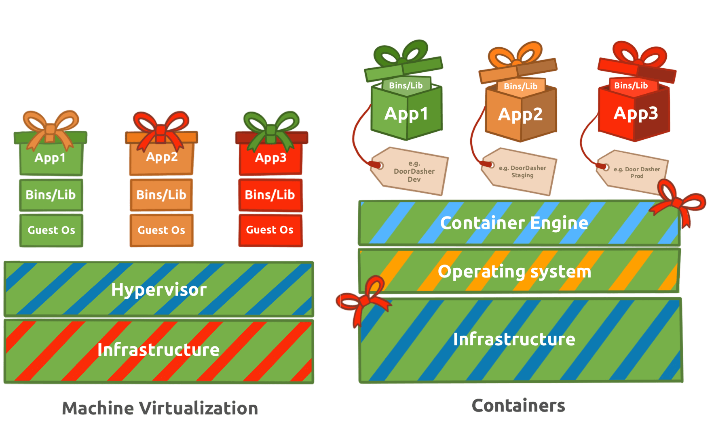
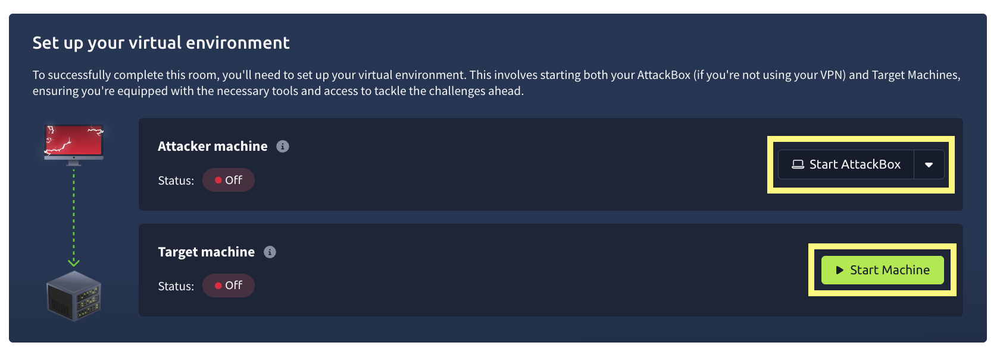
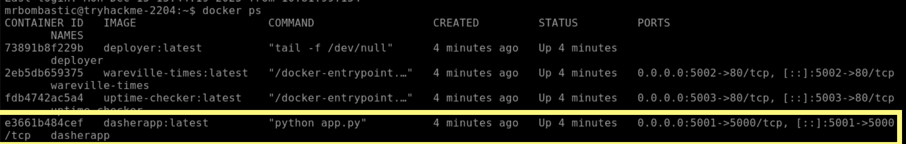
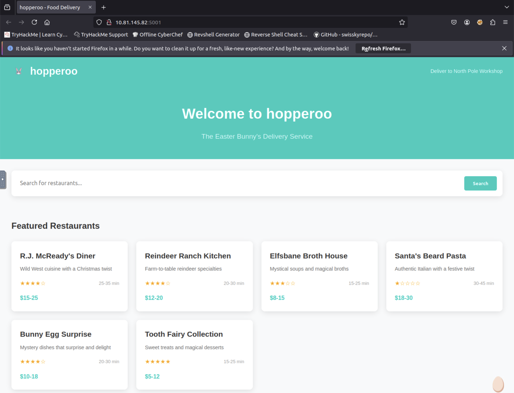
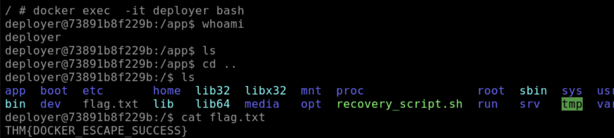
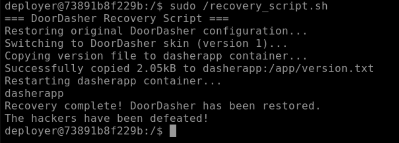
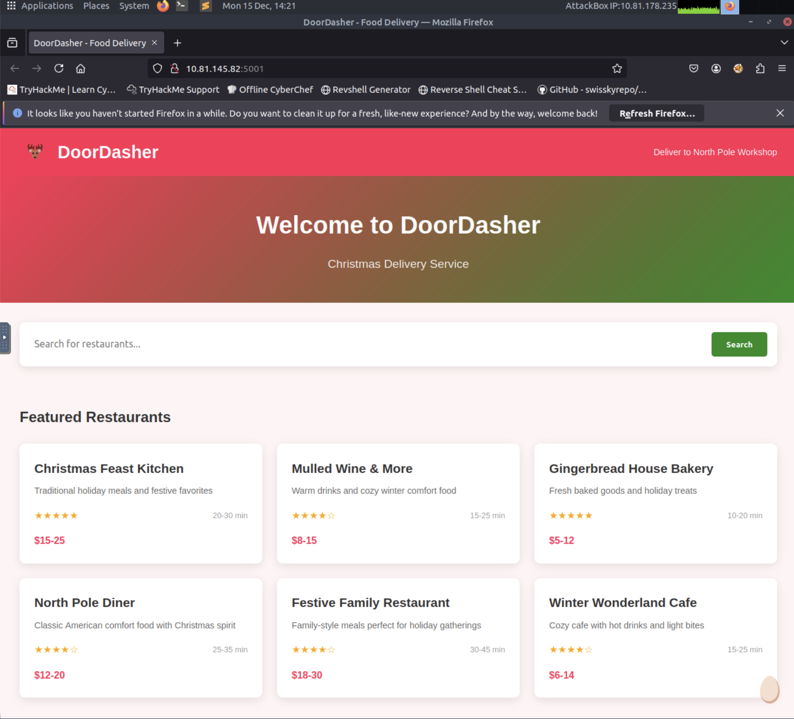
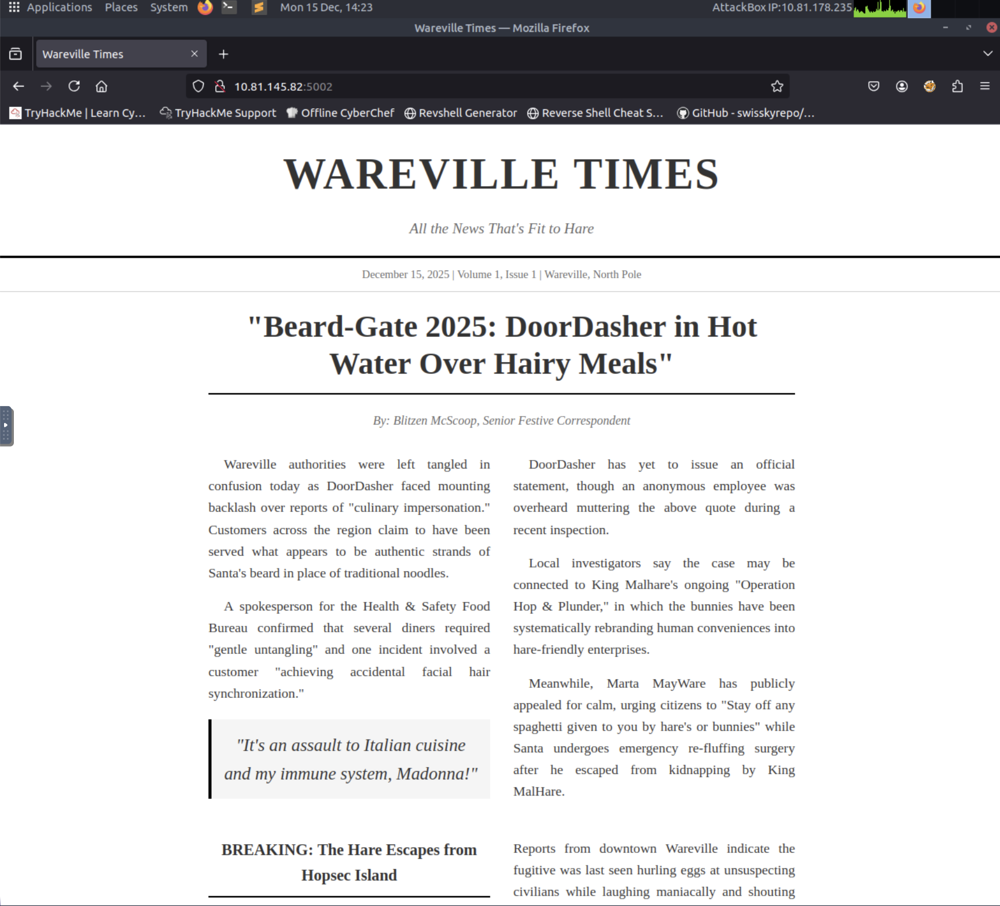
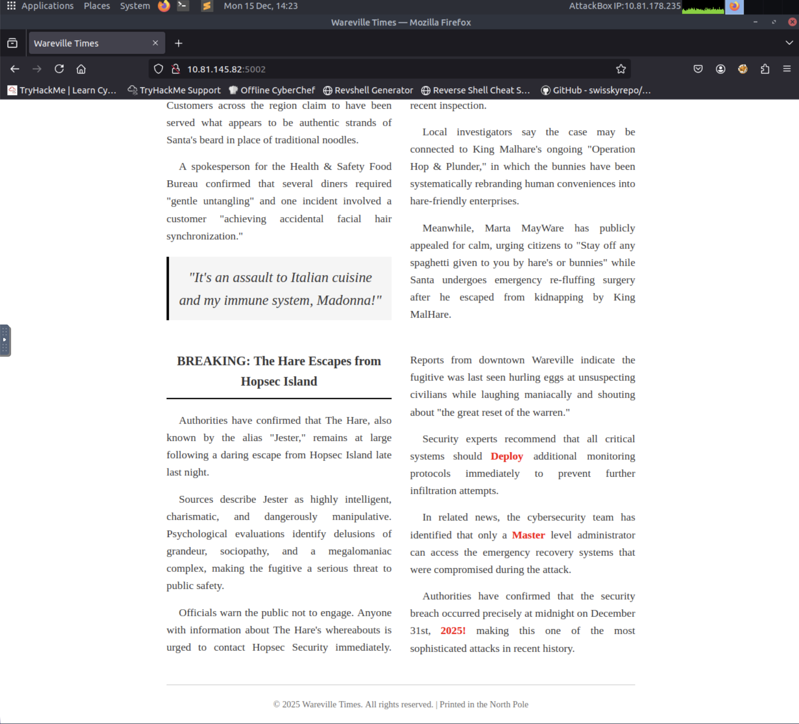
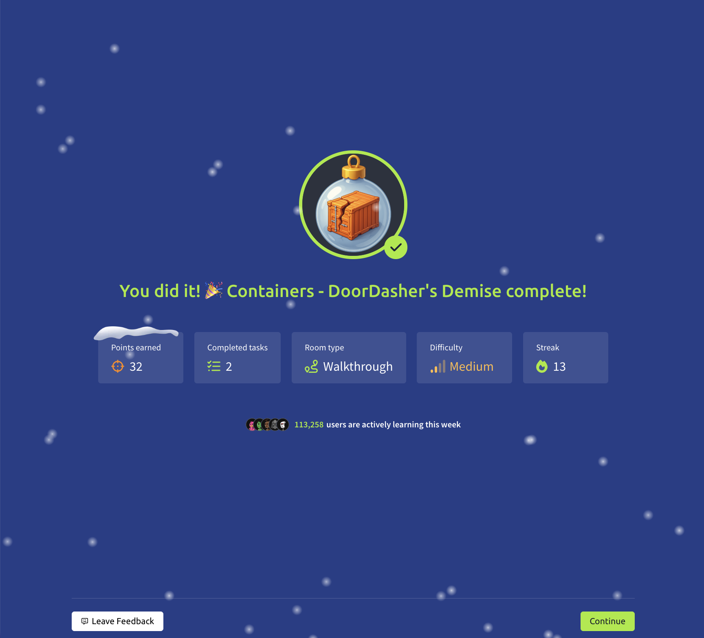

# Advent of Cyber 2025 Day 14 Walkthrough Containers - DoorDasher's Demise
Continue your Advent of Cyber journey and learn about container security.

### Story
DoorDasher is Wareville local food delivery site of the workers in The Best Festival company. The resident decide to order breakfast figure out that Kingh Malhare and his bundit had seized control over the festival rebranded completely and favourite dishes also been changed.report started flood into DoorDasher call center even the health and safety food org is panicking. Wareville authorities were left trangled in confusions hopperoo faced mounting backlash over report of "culinary impersonation". A spokesperson for health & safety food Bureau confirmed that several dinners required "gentle untangling" and one incident involve a customer achieving accidental facial hair  synchronisation.

immediately one of security engineer managed to log on and make a script to restore DoorDasher to its original state but unable to run Sir CarrotBaine caught his attemp and locked him out of the system. all was lost until the SOC team realised they had access to the system via their monitoring pod, an iptime checker for the site. 

As a SOC team member we can escape container and escalate privileges so that we can finish what our team started and save the site.

#### Learning Objectives

- Learn how containers and Docker work, including images, layers, and the container engine
- Explore Docker runtime concepts (sockets, daemon API) and common container escape/privilege-escalation vectors
- Apply these skills to investigate image layers, escape a container, escalate privileges, and restore the DoorDasher service
- DO NOT order “Santa's Beard Pasta

##### Container Security

container isa package that  solve the problem of installation, troubleshooting and conflicts of software versions  by packing applications along with their dependencies in isolated environment.  It is lightweight.

#### Container vs VMs

container share host OS  kernel, isolating only applications and their dependencies making them lighter and fast to start. container excel at deploying scalable , portable micro services.

##### Applications at Scale

if a specific part of application receives high traffic loads we can scale that part without scaling entire application using container making easy to scale to meet increasing demand. 

A container engine is a software that builds, runs and manages containers by leveraging the host OS kernel features like namespaces and cgroups.

Example : Docker

Docker is a container engine that uses Dockerfiles, simple text scripts defining app environment and dependencies to build, package and run applications consistently across different systems. 

#### Docker
Docker is an open source platform to build, deploy and manage containers. containers are executable units of software which package and manage the software and components to run a service. they are lightweight because they isolate application and use the host OS kernel.

#### Escape Attack & Sockets
A container escape is a technique that enable code running inside a container to obtain rights or execute on host kernel beyond its isolated environment.  for example , creating a privileged container with access to the public internet from a test container with no internet access.

container use a client-server setup on the host. The CLI tools act as the client sending requests to the container daemon which handles the actual container management and execution. The runtime exposes and API server via Unix sockets to handle CLI and daemon traffic. 
If an attacker can communicate with the socket from inside the container they can exploit the runtime.

#### Challenge
our goal is to investigate the Docker layers and restore the defaced Hopperoo website to its original service. 
 step by step walk through the step to solve this challenge.

## Lab:

 click on start attack box  and start machine to start respective machines.

our target machine (VM) is 10.81.145.82 and our attacker machine is 10.81.178.235 .

on VM first use command docker ps  to check running services.we see 4 running container. 

our main container is running with image name dasherapp on port 5001 
 now we access web application using attack machine `http://10.81.145.82:5001`. 
 

 we will explore uptime-checker using command `docker exec -it uptime-checker sh`  here docker exec will run a command inside a container, -it give interactive shell inside the uptime-checker container  and sh stand for shell.

we will use `ls -la /var/run/docker.sock` to reach inside docker engine communication socket  to check socket access . we are executing  container escape  attack.

this output means we can access the file.
now we use `docker exec -it deployer bash`  to access the deployer container . 

we get our flag : THM{DOCKER_ESCAPE_SUCCESS}

run recovery script to recover  using sudo /recovery_script.sh

after recovery we confirm opening website again.

 for bonus question part. run docker ps  we see port 5002 host wareville-times website. 

 scrolling the website we see
  Deploy Master and 2025! mark in red , trying this help to change password 

#### Answer the questions below

1. What exact command lists running Docker containers?
Ans : docker ps

2. What file is used to define the instructions for building a Docker image? 
Ans : Dockerfile

3. What's the flag?
Ans: THM{DOCKER_ESCAPE_SUCCESS}

4. Bonus Question: There is a secret code contained within the news site running on port `5002`; this code also happens to be the password for the deployer user! They should definitely change their password. Can you find it?
Ans : DeployMaster2025!

we  have successfully completed Advent of Cyber 2025 Day 14 Walkthrough  Containers - DoorDasher's Demise. Thank you 
