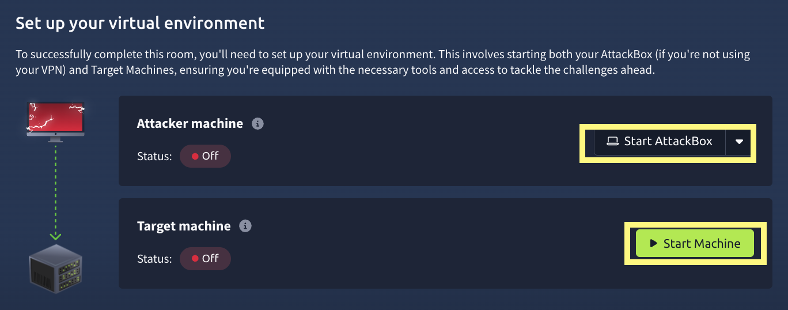
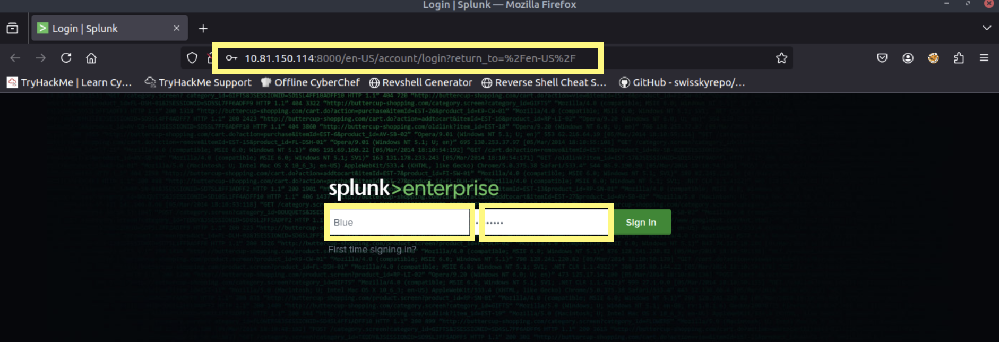
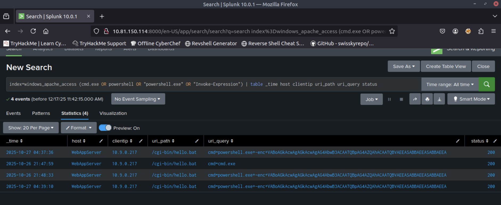
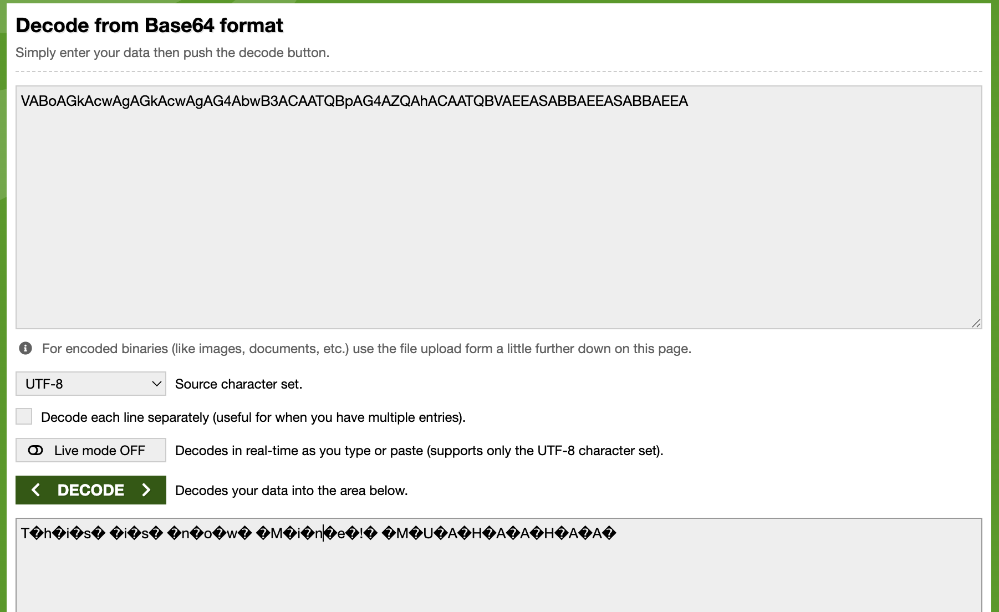
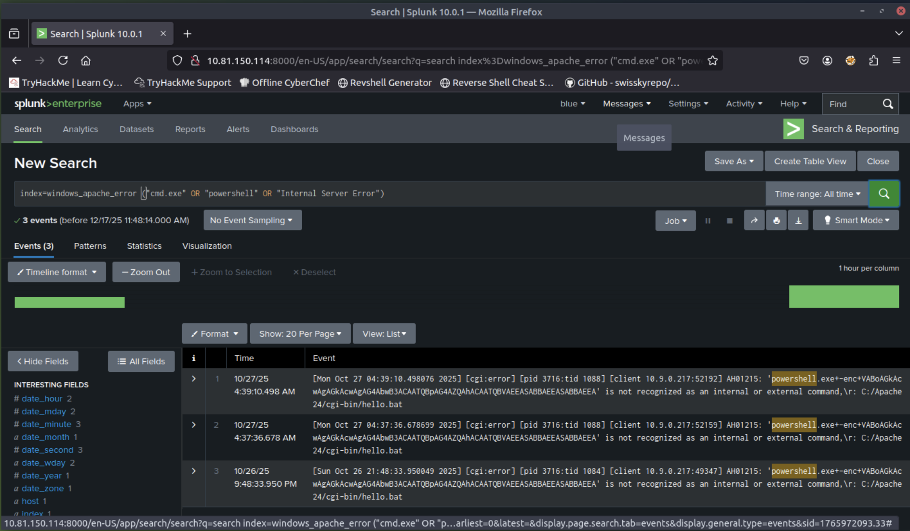
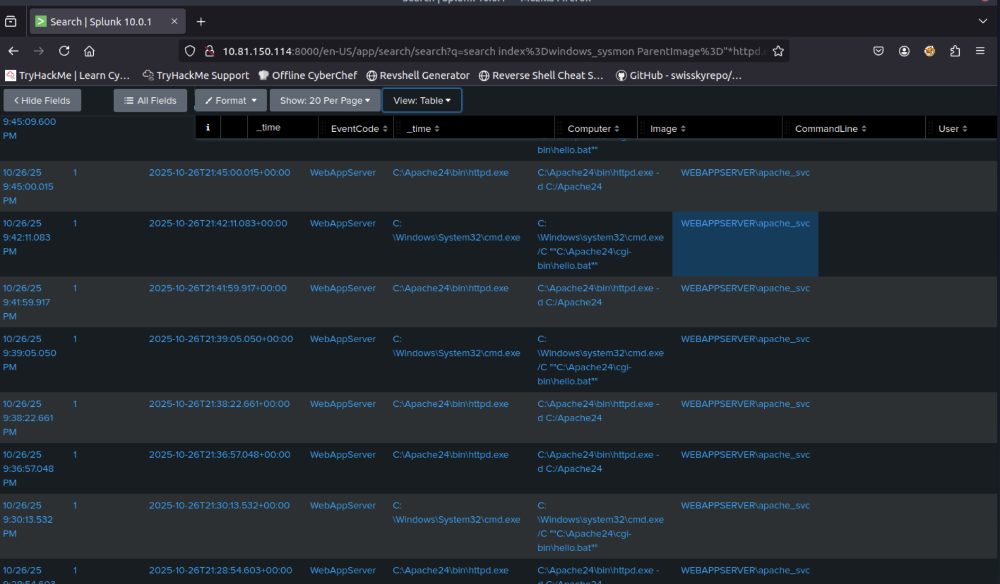
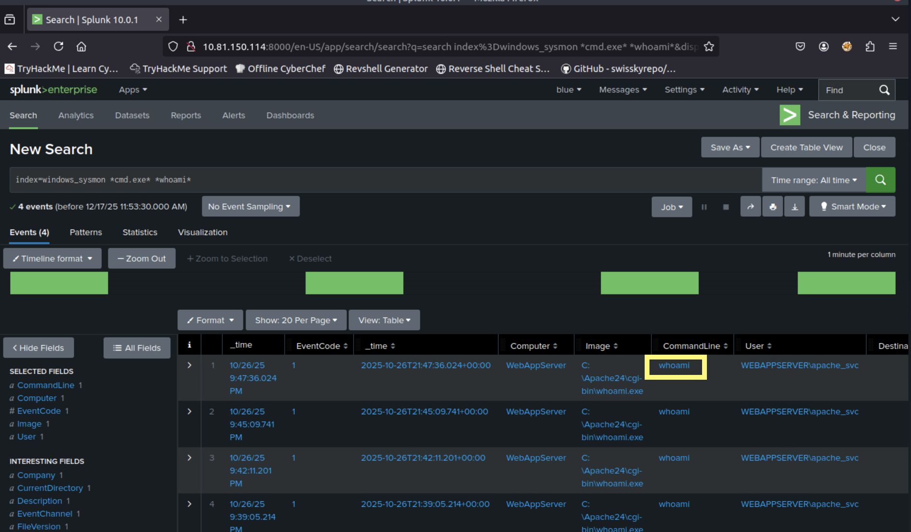
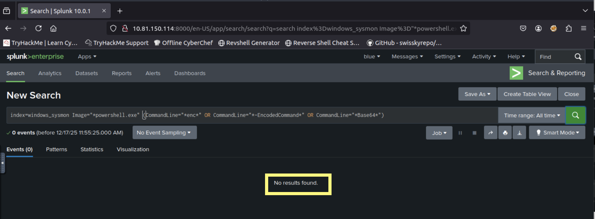

# Advent of Cyber 2025 Day 15 Walkthrough Web Attack Forensics - Drone Alone

Explore web attack forensics using Splunk.

### Story

TBFC’s drone scheduler web UI is getting strange, long HTTP requests containing Base64 chunks. Splunk raises an alert: “Apache spawned an unusual process.” On some endpoints, these requests cause the web server to execute shell code, which is obfuscated and hidden within the Base64 payloads.

Task as a Blue Teamer : Triage the incident, identify compromised hosts, extract and decode the payloads and determine the scope. 

we will use Splunk to pivot between Web (apache) logs  and host level telemetry.

#### Learning Objectives

- Detect and analyze malicious web activity through Apache access and error logs
- Investigate OS-level attacker actions using Sysmon data
- Identify and decode suspicious or obfuscated attacker payloads
- Reconstruct the full attack chain using Splunk for Blue Team investigation

### Logging into Splunk

After started AttackBox and target machine we will use firefox on AttackBox to access Splunk dashboard at  http://MACHINE_IP:8000 using provided credentials

after successful login we will land on Search Page

##### Detect Suspicious Web Commands
First we will search for HTTP request that might show malicious activity.
use `index=windows_apache_access (cmd.exe OR powershell OR "powershell.exe" OR "Invoke-Expression") | table _time host clientip uri_path uri_query status`

basically this query search web access logs for any HTTP requests that include sign of common execution attemps such as cmd.exe,PowerShell or Invoke-Expression.  this query helps to identify possible  Command Injection attacks where evil attacker tries to execute system commands through a vulnerable CGI script(hello.bat).

here we are interested in base64-encoding strings. once we spot encoded powershell command , decode using `base64decodr.org`  to understand what attacker was trying to do. 

 copy the encoded powershell string and paste into www.base64decode.org upper field then click decode.

#### Looking for Server side Error or Command Execution in Apache Error Logs

In this section we focus on inspecting web server error logs. we will use this command : `index=windows_apache_error ("cmd.exe" OR "powershell" OR "Internal Server Error")`

this query inspect Apache error logs for sign of execution attempts or internal failure cause by malicious requests. we are searching error message with particular term such as cmd.exe and powershell.
make sure to select View:Raw from dropdown menu above Event field.

If a request like `/cgi-bin/hello.bat?cmd=powershell` triggers a 500 “Internal Server Error,” it often means the attacker’s input was processed by the server but failed during execution, a key sign of exploitation attempts.

Checking these results helps confirm whether the attack **reached the backend** or remained blocked at the web layer.

#### Trace Suspicious Process Creation From Apache

Now we will explore  Sysmon for other malicious executable files that webserver might have pawned. for that we will use  splunk query :  `index=windows_sysmon ParentImage="*httpd.exe"`
 this query docus on process relationship from sysmon logs specially when parent process is apache(httpd.exe)
select View:Table above the Event display field:

if result shows child process such as 
`ParentImage = C:\Apache24\bin\httpd.exe`
`Image        = C:\Windows\System32\cmd.exe`

It indicate a successful command injection where apache executed a system command.

This finding is one of the strong indicator of web attack penetrated the OS.

####  Confirm Attacker Enumeration Activity
we will discover what specific program found previously. we will use `index=windows_sysmon *cmd.exe* *whoami*`
 This query look for command execution logs where cmd.exe ran the command whoami.
 
attacker ofter use whoami common immediately after gaining code execution to determine which user account their malicious process is running as.

finding these events confirm the attackers post-exploitation reconnaissance , showing that the injected comman was executed on the host

#### Identify Base64-Encoded PowerShell Payloads

our work now is to find all successfully encoded commands. For searching encoded strings we will use following query `index=windows_sysmon Image="*powershell.exe" (CommandLine="*enc*" OR CommandLine="*-EncodedCommand*" OR CommandLine="*Base64*")`

this will detect PowerShell commands containing Encoded command or Bash64text , a common technique attacker use to hide real commands.

if defences are correctly configured  this query return no results which result encoded payload never ran.

#### Answer the questions below

1. What is the reconnaissance executable file name?
Ans : whoami.exe
 we found this file using  `index=windows_sysmon *cmd.exe* *whoami*` query

2. What executable did the attacker attempt to run through the command injection?
Ans : PowerShell.exe
 we found this using `index=windows_apache_error ("cmd.exe" OR "powershell" OR "Internal Server Error")` query

we  have successfully completed Advent of Cyber 2025 Day 15 Walkthrough Web Attack Forensics - Drone Alone

